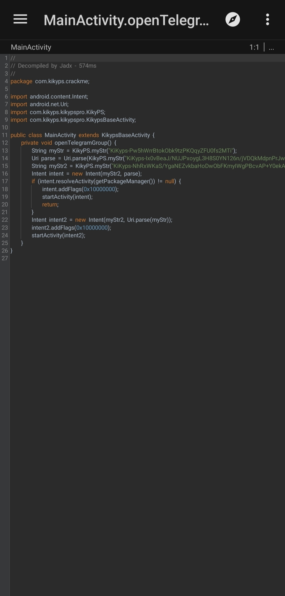
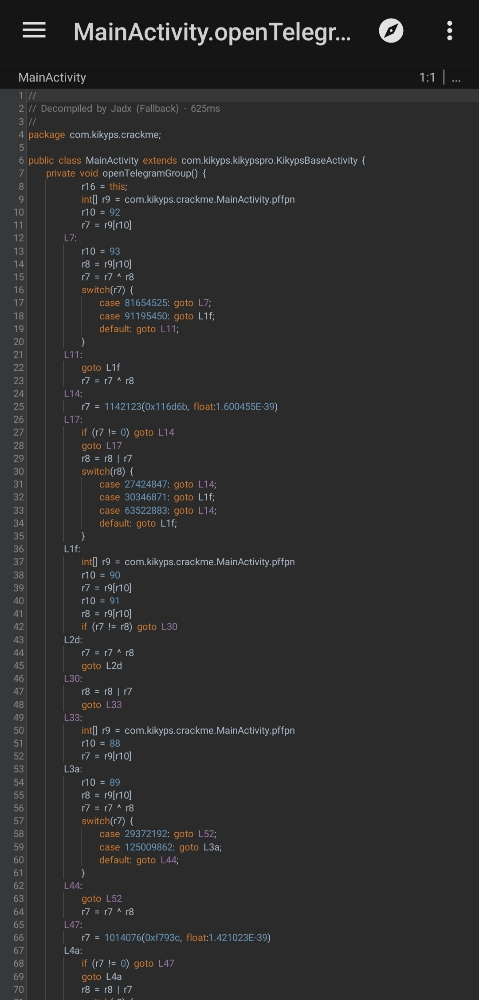
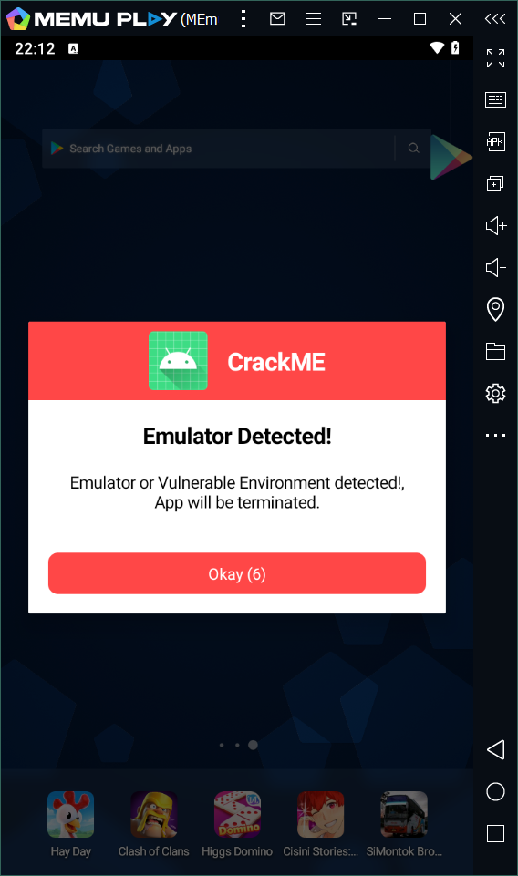
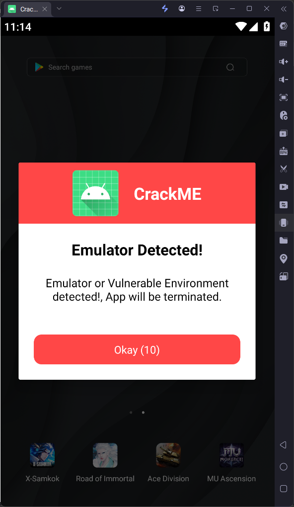
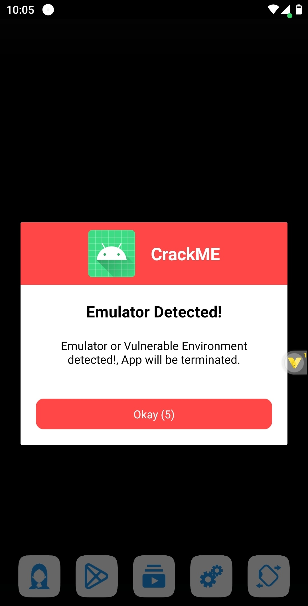
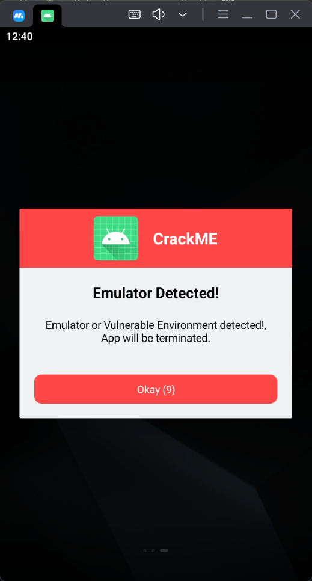
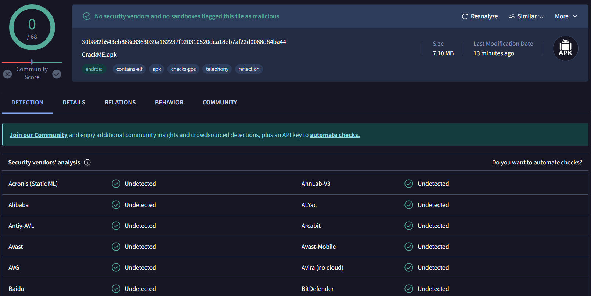
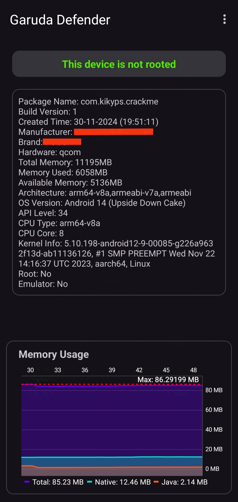

# Garuda Defender

 

Android RASP project by KiKyps, Protect Mobile App from any vulnerabilities.

\#1 The First Indonesian Android Security Framework :indonesia:. 
\#Cyber Security Solution.

# Protection Feature Provided

#### Runtime Application Self-Protection

|                 Feature                          |      Status     |
|:-------------------------------------------------|:---------------:|
| &#x2611; Anti Hooking                         	   |    Available    |
| &#x2611; Dynamic tamper detection (e.g Code Patching) |    Available    |
| &#x2611; Anti FRIDA                         	   |    Available    |
| &#x2611; Anti Debugging (Java & Native)               |    Available    |
| &#x2611; Root Detection                         	   |    Available    |
| &#x2611; Certificate Signature Integrity              |    Available    |
| &#x2611; Content Integrity                     	   |    Available    |
| &#x2611; Emulator/Virtual Machine Detection     	   |    Available    |
| &#x2611; Game Engine Protection "Anti Cheat"   	   |    Available    |
| &#x2611; Memory Patch Detection               	   |    Available    |
| &#x2611; Dalvik code patch detection            	   |    Available    |
| &#x2611; Anti Screen Capturing/Screen Sharing         |    Available    |
| &#x2610; Auto Clicker Detection		 	   |   Coming Soon   |
| &#x2610; Fake GPS Detection               	   |   Coming Soon   |
| &#x2610; GameGuardian Detection               	   |   Coming Soon   |

#### Code Protection

|                      Feature                         |      Status     |
|:-----------------------------------------------------|:---------------:|
| &#x2611; String Encryption (Java Layer Protection)        |    Available    |
| &#x2611; Control Flow Obfuscation (Java Layer Protection) |    Available    |
| &#x2610; Obfuscate method and field names                 |   Coming Soon   |

#### Network Communication Protection

|                                             Feature                                         |      Status     |
|:--------------------------------------------------------------------------------------------|:---------------:|
| &#x2611; HTTP Capture Detection	   	   	                                              |    Available    |
| &#x2610; SSL Pinning (Strong and Private built from scratch and is not like existing certificate pinner libraries) |   Coming Soon   |

# Protection Mechanism

- Realtime Protection
- Protection is timeless and strictly protects content 360 degrees
- Using Cryptography
- Obfuscated Methods and Strings
- Works fully offline

### PREVIEW
#### 1. Control Flow Obfuscation
Protecting the application's business logic.

|                      Before                    |                      After                    |
| :--------------------------------------------: | :-------------------------------------------: |
|  |  |

#### JADX failed to decompile

#### 2. Emulator detection
Detect all types of emulators, such as gaming emulators and any Android virtual device, also supports detecting Android emulators such as VPhoneGaGa, Vmos, Virtual Master, F1VM (X8 Sandbox), twoyi

|      Memu Emulator         |     LDPlayer Emulator       |      VPhoneGaGa Android Virtual/Emulator     |     Mumu Emulator    |
| :--------------------------------------------: | :-------------------------------------------: | :-------------------------------------------: | :-------------------------------------------: |
|  |  |  |  |

I can't provide many example images for all emulator detection, you can try it yourself.

#### NOTE

Emulator detection is more suitable for games, this feature is specifically for game developers who don't want their games to be played via an emulator for certain reasons.

#### 3. HTTP Capture Detection

  
A demo for Anti HTTP Capture

https://github.com/kikyps/GarudaDefender/assets/38471660/3a20a2d9-1193-4bb2-91c0-d391824741ca

### Demo for Android? You can test it yourself directly!

# TODO
- Very strong SSL Pinning, "HTTP Capture Detection is enough and this will continue to be developed, but if needed it may be added in the future".
- Auto Clicker Detection.
- Fake GPS Detection.
- Integration with servers for more convenient detection monitoring and control.
- Built-in Anti-Malware (Threat detection from other applications, similar to what Play Protect does).

# FAQ

**1. Support Most Android Version**

- Support Android 5.0 - 15 (API level 21 - 35).
- Support armeabi-v7a, arm64-v8a, x86 and x86_64.
- Support Android Framework App (Flutter, React Native)

**2. Extremely fast and modern vulnerability detection**

> Sometimes, expensive products out there have slow detection systems that consume a lot of resources. We confidently make this statement and are willing to compare the sophistication of our product against others, because we have conducted comparative research and obtained proven results.

**`Designed for extremely fast detection and high stability, advanced algorithms to adapt to modern vulnerabilities and tested intently and measurably.`**

**3. Less RAM Consumption**

Rich in features but still runs efficiently with minimal RAM usage without overhead and memory leaks.

**`Testing carried out in debug mode in theory at release should be lower than the results in the video.`**

**4. Does not affect application performance**

We employ the most effective methods to maintain the performance of the application. This framework ensures that the application remains fast and preserves the speed of app launch.

> We don't use Shell/ClassLoader because we find it less efficient and it slows down the application launch. Decrypting and loading the dex files take up considerable time, which contributes to the delay. Another drawback is that shells can be easily repackaged.

In doing so, we opt for another approach to safeguard your Java source code, protecting it from the exposure of application business logic and the authenticity of its code.

**5. Root User Friendly**

> Sometimes some security framework providers block root users to prevent unwanted things, of course this will have a bad impact on root users who do not have a cyber crime background and have bad intentions for the application user, it is true that detecting root can prevent hackers from moving forward to carry out the action. but not all root users have the same goals and characteristics.

`So with this we really pay attention to security gaps without needing to block access for certain users.
But we still provide the root detection feature as an option and feature support if our clients need it.`\
\
**`So with our project, root users with malicious intent will not be useful even if they have root access`**\
\
**6. Friendly with other applications and piracy tools**

> Sometimes some security framework providers block piracy tools or applications to prevent unwanted things, of course this is not friendly in our opinion.

**`Therefore our goal is that all such tools will be useless for our framework, there is no need to blindly block other applications that are not desired.`**\
\
**7. Custom ROM User Friendly (Unlocked Bootloader)**

> Sometimes some security framework providers detect an unlocked bootloader, to prevent unwanted things, of course this is not friendly for users who like to customize their smartphones.

**`As in the first point, not all users with root or unlocked bootloader have bad intentions.`**

**8. No threats or viruses detected**

This framework does not cause false detection as a virus, of course this will increase the success rate of submitting applications to the Playstore

  
<a href="https://www.virustotal.com/gui/file/30b882b543eb868c8363039a162237f920310520dca18eb7af22d0068d84ba44/detection" target="_blank">Check Result</a>

**Download Demo APK**

## Limitations

- **At the moment, the framework only works for Android applications.**
- **Currently in development for standalone deployment without the need for coding. If you need a demo in your application, please contact us, and we will integrate it into your app.**

## Lessons

Of course we are aware and care about the security, authenticity, robustness in our systems, so we continue to maintain and research modern vulnerabilities to continue to maintain our security. Carrying out rigorous analysis and testing from various angles to provide the best service for our users.

# Interested?

This project is not available as open-source. If you are interested and want to build a business, we are open to it.

Contact:\
r383425@proton.me