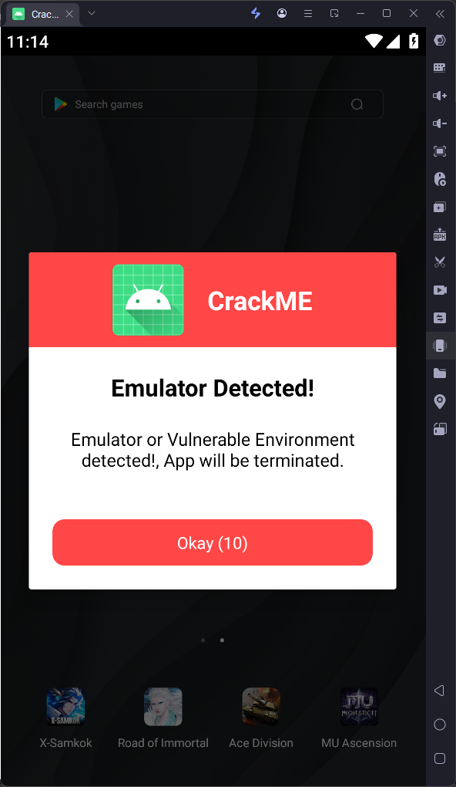
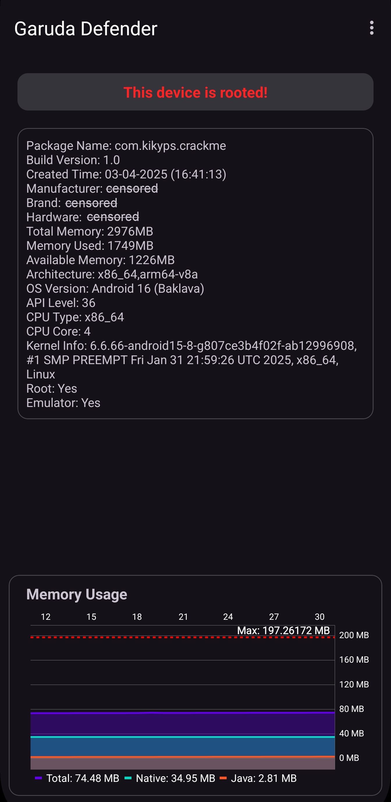

# Garuda Defender

Android RASP project, Protect Mobile App from any vulnerabilities.

\#1 The First Indonesian Android Security Framework :indonesia:. 
\#Cyber Security Solution. 
\#Since 2023 (Repository will always be overwritten).

# Protection Feature Provided

#### Runtime Application Self-Protection

|                 Feature                          |      Status     |
|:-------------------------------------------------|:---------------:|
| 

&#x2611; Anti Hooking
Inline Hook, PLT Hook, Stackplz, Frida, jshook, Java Hook (xposed/lsposed, simple hook, pine, etc)
  |    Available    |
| 

&#x2611; Dynamic tamper detection (e.g Code Patching)
Anti patch code, such as dex, libso, hermes engine (React Native).
  |    Available    |
| 

&#x2611; Anti FRIDA
Detect any modified frida framework based on frida or strong frida.
  |    Available    |
| 

&#x2611; Anti Stackplz
Detect Stackplz Android Tracing & Hooking.
  |    Available    |
| 

&#x2611; Anti Debugging & Breakpoint (Java & Native)
Detects debugging attempts on your application through a wide variety of tools, including IDA PRO, Binary Ninja, GDB, ADB, etc
  |    Available    |
| 

&#x2611; Anti Emulation
String encryption is protected with anti-emulation mechanisms such as the unicorn engine and the qiling framework.
  |    Available    |
| 

&#x2611; Anti Instrumentation
Protected with Anti-Instrumentation mechanisms [See https://frida.re/docs/stalker](https://frida.re/docs/stalker/)
  |    Available    |
| 

&#x2611; Memory Protection
Sensitive data protected with obfuscated region & pointer encryption
  |    Available    |
| 

&#x2611; Root Detection
Resist root hiders like Shamiko, ZygiskNext, and other trick module
  |    Available    |
| 

&#x2611; Certificate Signature Integrity
Certificate Signature anti-tamper app. (supports sign scheme v1, v2, v3)
  |    Available    |
| 

&#x2611; Emulator/Virtual Machine Detection
Detect all types of emulators, such as gaming emulators and any Android virtual device, also supports detecting Android emulators such as VPhoneGaGa, Vmos, Virtual Master, F1VM (X8 Sandbox), twoyi
  |    Available    |
| 

&#x2611; Game Engine Protection "Anti Cheat"
Protecting Game Engine from tampering or hacking for anti game cheat based on (Unity, Unreal Engine, Cocos)
  |    Available    |
| 

&#x2611; Memory Patch Detection
Anti Memory Patching, such as memory patcher framework, and GameGuardian
  |    Available    |
| 

&#x2611; Dalvik code patch detection
Anti tools patcher such as (LuckyPatcher, JasiPatcher, etc), Anti modify without modifying the APK file.
  |    Available    |
| 

&#x2611; Screen Protection
Anti ScreenShot, ScreenCapturing, ScreenRecording, and ScreenSharing.
         |    Available    |
| 

&#x2611; Auto Clicker & Overlay attacks Detection
Protects the screen from malicious clickers, and prevents overlay attacks
  |   Available   |
| 

&#x2610; Fake GPS Detection

  |   Coming Soon   |

#### Code Protection

|                      Feature                         |      Status     |
|:-----------------------------------------------------|:---------------:|
| &#x2611; String Encryption (Java Layer Protection)        |    Available    |
| &#x2611; Control Flow Obfuscation (Java Layer Protection) |    Available    |
| &#x2610; Obfuscate method and field names                 |   Coming Soon   |

#### Network Communication Protection

|                                             Feature                                         |      Status     |
|:--------------------------------------------------------------------------------------------|:---------------:|
| &#x2611; HTTP Capture Detection	   	   	                                              |    Available    |
| &#x2611; Certificate SSL Pinning                                                      |   Available   |

# Protection Mechanism

- Realtime Protection
- Protection is timeless and strictly protects content 360 degrees
- Using Cryptography
- Obfuscated Methods and Strings
- Works fully offline

## Changelog

### New support encrypt static string field

[See full changelog here](https://github.com/kikyps/GarudaDefender/releases)

### PREVIEW & DEMO
#### 1. Control Flow Obfuscation
Protecting the application's business logic.

|                      Before                    |                      After                    |
| :--------------------------------------------: | :-------------------------------------------: |
|  |  |

#### JADX failed to decompile

#### 2. Emulator detection

|      Memu Emulator         |     LDPlayer Emulator       |      VPhoneGaGa Android Virtual/Emulator     |     Mumu Emulator    |
| :--------------------------------------------: | :-------------------------------------------: | :-------------------------------------------: | :-------------------------------------------: |
|  |  |  |  |

I can't provide many example images for all emulator detection, you can try it yourself.

#### 3. HTTP Capture Detection

  
A demo for Anti HTTP Capture

https://github.com/kikyps/GarudaDefender/assets/38471660/3a20a2d9-1193-4bb2-91c0-d391824741ca

### For Android

https://github.com/user-attachments/assets/1e517ff7-f531-41ff-8ce5-1d6a750f4c40

#### 4. Certificate SSL Pinning (ANTI BYPASS)

How does this work so it is anti bypass?

Strong and Private built from scratch and is not like existing certificate pinner libraries

  
A demo for SSL Pinning

https://github.com/user-attachments/assets/5872f997-92a0-4015-a2a9-f3381e149ba6

#### 5. Dalvik code patch detection

  
A demo for Dalvik code patch detection using LuckyPatcher

https://github.com/user-attachments/assets/0f1837b5-de47-49e6-acd6-56ec49ec6cb7

#### 6. Auto Clicker & Overlay attacks Detection

  
A demo for Auto Clicker & Overlay attacks Detection

https://github.com/user-attachments/assets/20ddc04e-6996-43f4-ad00-49f85f5e2490

#### 7. ScreenSharing Protection

  
A demo for ScreenSharing Protection

https://github.com/user-attachments/assets/a74cbd23-84b9-437c-88e0-ab46eeea310d

#### 8. Support Multi-Language

|      English Language      |    Indonesian Language    |      Russian Language     |     Chinese Language    |
| :--------------------------------------------: | :-------------------------------------------: | :-------------------------------------------: | :-------------------------------------------: |
|  |  |  |  |

Supports 40 languages

|    Language     |      Status     |
|-----------------|:---------------:|
| English         |      &#x2611;  |
| Indonesian      |      &#x2611;  |
| Chinese         |      &#x2611;  |
| Russian         |      &#x2611;  |
| Hindi           |      &#x2611;  |
| Turkish         |      &#x2611;  |
| German          |      &#x2611;  |
| Spanish         |      &#x2611;  |
| Italian         |      &#x2611;  |
| Portuguese      |      &#x2611;  |
| Dutch           |      &#x2611;  |
| French          |      &#x2611;  |
| Ukrainian       |      &#x2611;  |
| Kazakh          |      &#x2611;  |
| Japanese        |      &#x2611;  |
| Korean          |      &#x2611;  |
| Vietnamese      |      &#x2611;  |
| Thai            |      &#x2611;  |
| Filipino        |      &#x2611;  |
| Burmese         |      &#x2611;  |
| Polish          |      &#x2611;  |
| Arabic          |      &#x2611;  |
| Persian         |      &#x2611;  |
| Urdu            |      &#x2611;  |
| Afrikaans       |      &#x2611;  |
| Belarusian      |      &#x2611;  |
| Georgian        |      &#x2611;  |
| Uzbek           |      &#x2611;  |
| Lithuanian      |      &#x2611;  |
| Romanian        |      &#x2611;  |
| Estonian        |      &#x2611;  |
| Nepali          |      &#x2611;  |
| Latvian         |      &#x2611;  |
| Armenian        |      &#x2611;  |
| Azerbaijani     |      &#x2611;  |
| Danish          |      &#x2611;  |
| Norwegian       |      &#x2611;  |
| Greek           |      &#x2611;  |
| Slovak          |      &#x2611;  |
| Finnish         |      &#x2611;  |

#### NOTE

1. Emulator detection is more suitable for games, this feature is specifically for game developers who don't want their games to be played via an emulator for certain reasons.

2. HTTP Capture detection and SSL Pinning are different but share the same goal of protecting network communications from malicious activities commonly conducted via MITM attacks. The difference between the two is that HTTP Capture detection directly identifies network capture activities such as HTTP, while SSL Pinning verifies the authenticity and integrity of the server’s SSL certificate.

3. **Screen Capture protection and Anti auto clicker are not activated in this demo app!**

# TODO
- Fake GPS Detection.
- Integration with servers for more convenient detection monitoring and control.
- Built-in Anti-Malware (Threat detection from other applications, similar to what Play Protect does).

# FAQ

**1. Support Most Android Version**

- Support Android 5.0 - 16 (API level 21 - 36).
- Support armeabi-v7a, arm64-v8a, x86 and x86_64.
- Support Android Framework App (Flutter, React Native)

**2. Extremely fast and modern vulnerability detection**

> Sometimes, expensive products out there have slow detection systems that consume a lot of resources. We confidently make this statement and are willing to compare the sophistication of our product against others, because we have conducted comparative research and obtained proven results.

**`Designed for extremely fast detection and high stability, advanced algorithms to adapt to modern vulnerabilities and tested intently and measurably.`**

#### Launch speed testing

**Results will vary depending on device specifications!**

**3. Less RAM Consumption**

Rich in features but still runs efficiently with minimal RAM usage without overhead and memory leaks.

#### Memory usage comparison

Comparison of memory usage on protected apk and unprotected apk

|                 Unprotected APK              |      Protected APK With Garuda Defender        |
| :--------------------------------------------: | :-------------------------------------------: |
|  |  |

|  Unprotected APK             |
| :--------------------------------------------: |
|  |

|  Protected APK With Garuda Defender  |
| :--------------------------------------------: |
|  |

**Results will vary depending on device specifications!**

**`Testing carried out in debug mode in theory at release should be lower than the results in the video.`**

**4. Does not affect application performance**

We employ the most effective methods to maintain the performance of the application. This framework ensures that the application remains fast and preserves the speed of app launch.

> We don't use Shell/ClassLoader because we find it less efficient and it slows down the application launch. Decrypting and loading the dex files take up considerable time, which contributes to the delay. Another drawback is that shells can be easily repackaged.

In doing so, we opt for another approach to safeguard your Java source code, protecting it from the exposure of application business logic and the authenticity of its code.

**5. Friendly with other applications and piracy tools**

> Sometimes some security framework providers block piracy tools or applications to prevent unwanted things, of course this is not friendly in our opinion.

**`Therefore our goal is that all such tools will be useless for our framework, there is no need to blindly block other applications that are not desired.`**\

**6. No Developer Option Blocker**

> One of the funniest things is why block the developer options?

**`GarudaDefender will handle everything without restricting your usage policies or disrupting the user experience.`**

**7. No threats or viruses detected**

This framework does not cause false detection as a virus, of course this will increase the success rate of submitting applications to the Playstore

**8. No special android permissions required**

You can analyze it yourself by opening AndroidManifest.xml, see uses-permission, there are no permissions used, So don't claim we are digging up your information!

  
<a href="https://www.virustotal.com/gui/file/a5f4bcc092895fa2311d689bc6ed20227fb84eff49cfed9b578aa7c5965c7701/detection" target="_blank">Check Result</a>

**Download Demo APK**

## Limitations

- **At the moment, the framework only works for Android applications.**
- **Currently in development for standalone deployment without the need for coding. If you need a demo in your application, please contact us, and we will integrate it into your app.**

## Lessons

Of course we are aware and care about the security, authenticity, robustness in our systems, so we continue to maintain and research modern vulnerabilities to continue to maintain our security. Carrying out rigorous analysis and testing from various angles to provide the best service for our users.

# Interested?

This project is not available as open-source. If you are interested and want to build a business, we are open to it.

Contact:\
r383425@proton.me